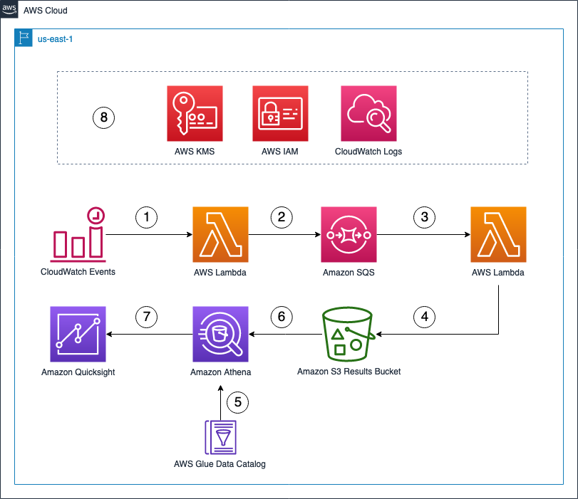

# Elevate your AWS IAM policy using IAM Access Analyzer policy validation

## Description

This implementation demonstrates the AWS Identity and Access Management (IAM) Access Analyzer policy validation capability. Learn how to use it to build a batch job to report on existing policy findings and visualize the results using Amazon Quicksight.

You will:

- Build an AWS Lambda function to validate IAM policies using IAM Access Analyzer `ValidatePolicy` API call.
- Store your IAM Access Analyzer validation results in a scalable and cost effective manner using Amazon Simple Storage Service (Amazon S3).
- Gain insights from IAM Access Analyzer findings using Amazon Athena and QuickSight.
- Run periodic validations using Amazon CloudWatch Events scheduled events.
- Add scalability and fault tolerance to your validations using Amazon Simple Queue Service (Amazon SQS).

## Overview



1. This implementation is a serverless batch job triggered by a CloudWatch Events scheduled event rule. The scheduled event rule is setup to run daily.
2. The first Lambda function `list-iam-policy-for-access-analyzer` lists all [customer managed policies](https://docs.aws.amazon.com/IAM/latest/UserGuide/access_policies_managed-vs-inline.html#customer-managed-policies) and for each IAM policy, it sends a message to a SQS queue. The message contains the IAM policy [Amazon Resource Name (ARN)](https://docs.aws.amazon.com/IAM/latest/UserGuide/reference_identifiers.html#identifiers-arns) and the policy document.
3. The second Lambda function `validate-iam-policy-for-access-analyzer` polls the SQS queue for messages. For each message, the Lambda function extracts the policy document and validates it using IAM Access Analyzer `ValidatePolicy` API call.
4. The Lambda function `validate-iam-policy-for-access-analyzer` stores evaluation results in the S3 results bucket.
5. AWS Glue is used to create an AWS Glue Database and an AWS Glue Table. The AWS Glue Table contains the schema for the IAM Access Analyzer findings stored in the S3 results bucket.
6. Amazon Athena natively uses the AWS Glue Table to query the data stored in the S3 results bucket.
7. Amazon QuickSight uses Amazon Athena as a Data Source to visualize IAM Access Analyzer findings.
8. AWS IAM is used to provide IAM roles and IAM policies for used AWS services. AWS Key Management Service (AWS KMS) is used to provide a Customer Master Key (CMK) used by supported AWS services. CloudWatch Logs is used to store Lambda functions execution logs.

## Contents

```
.
|-- README.md
|-- template.yaml
|-- architecture_diagram.png
|-- CODE_OF_CONDUCT.md
|-- CONTRIBUTING.md
|-- LICENSE
```

# Builders Session Steps
## 0. Prerequisites
This section describes the pre-requisites you must have in order to sucessfully run this implementation.
- Have a laptop with internet connectivity.
- Have a web browser to access the AWS Management Console. For information on supported browsers, see [Supported Browsers](https://docs.aws.amazon.com/quicksight/latest/user/supported-browsers.html)\.
- Have an AWS account with an AWS IAM access with sufficient privileges.

## 1. Deploy the implementation
> The implementation is partially deployed (except Amazon QuickSight dashboard) in AWS accounts vended by AWS EventEngine during an AWS event. Skip step 3. 
1. Connect to your AWS account and choose `us-east-1` region. See [Choosing a Region](https://docs.aws.amazon.com/awsconsolehelpdocs/latest/gsg/select-region.html).
2. Go to the AWS CloudFormation Console. AWS CloudFormation is a service that gives you an easy way to create a collection of related AWS and third-party resources, and provision and manage them in an orderly and predictable fashion.
3. Use `template.yaml` to [Create a stack on the AWS CloudFormation console](https://docs.aws.amazon.com/AWSCloudFormation/latest/UserGuide/cfn-console-create-stack.html).
4. Check created resources under the [AWS CloudFormation console](https://console.aws.amazon.com/cloudformation/home?region=us-east-1#/stacks?filteringStatus=active&filteringText=&viewNested=true&hideStacks=false).
### Create a test event to trigger the batch job
1. Open the AWS Lambda console at https://console.aws.amazon.com/lambda/home?region=us-east-1#/functions/list-iam-policy-for-access-analyzer?tab=code
2. Under **Code source**, choose **Test**.
3. Under **Event name**, type in `triggerValidation` and confirm with **Create**.
4. Under **Code source**, choose **Test**.
5. Wait for the Lambda function execution to finish. You should get **OK from Lambda** in the **Execution results** tab.

## 2. Create the Amazon QuickSight resources
### Subscribe to Amazon QuickSight
1. Sign in to your AWS account and open Amazon QuickSight from the AWS Management Console\. It is located under Analytics, and you can find it by searching for "QuickSight"\.
2. Your AWS account number is displayed for verification purposes\. Choose **Sign up for QuickSight**\.
3. Choose **Standard**. To confirm, choose **Continue**\. A screen titled **Create your QuickSight account** appears\.
4. Under **Authentication method**, if you chose **Standard**, skip this step and proceed to the next one\.
5. Under **Account info**:
   - Type in a unique account name for Amazon QuickSight. For example, use `yourname-YYYYMMDD-quicksight` in the **QuickSight account name** field. Your account name can only contain characters \(A–Z and a–z\), digits \(0–9\), and hyphens \(\-\)\.
   - Type in a notification email addess in the **Notification email address** field. This email receives service and usage notifications\.
6. Ensure **Enable autodiscovery of data and users in your Amazon Redshift, Amazon RDS, and AWS IAM services.**, **Amazon Athena** and **Amazon S3** checkboxes are checked.
7. Provide access to the relevant S3 buckets to QuickSight (prefixed by qs-iam-aa-*)
8. Review the choices you made, then choose **Finish**\.
9. Once the Amazon QuickSight account creation process is finished, choose **Go to Amazon QuickSight** to go to the Amazon QuickSight home page.

### Create a new Dataset
1. Open Amazon QuickSight from the AWS Management Console\. It is located under Analytics, and you can find it by searching for "QuickSight"\. On the left pane, choose **Datasets**.
2. On the top right corner, choose **New dataset**.
3. Under the section **FROM NEW DATA SOURCES**, choose **Athena**.
4. Under **Data source name**, type in a name for the data source. For example, enter `access-analyzer-findings-dataset`. 
5. Select **Athena workgroup** `access-analyzer-findings-workgroup`.
6. Choose **Create data source** and wait for the popup to refresh with the new dataset.
7. Under **Database: contain sets of tables.**, choose the table `access-analyzer-findings`.
8. Under **Tables: contain the data you can visualize.**, select the view `v_access-analyzer-findings-view` and choose **Edit/Preview data** and wait for data set to be opened.
9. In the new view, choose the **String** field under the **validatedat** column. From the Dropdown select `Date`.
10. In the pop up window, type in `yyyy-MM-dd'T'HH:mm:ss.SSSSSS` as value in the date format field and confirm with **Update**
11. Repeat the same for the **datehour** field. Choose the **String** field under the **datehour** column, type in `yyyy/MM/dd` and confirm with **Update**
12. On the top right corner, save your changes with **Save & Publish**.
13. Go back to the QuickSight home page and open the newly created dataset. In the popup window select **Create analysis**.

### Create QuickSight Analysis - Visual: Count of Records by Finding Type
1. (If you didn't follow the steps before, open the analysis from the Quicksight home page.)
2. Select the `visual` which says "AutoGraph" on "Sheet 1".
3. On the bottom left, select as visual type **Donut Chart**.
4. Drag & drop the **findingtype** field from the left `Fields list` into the `Group/Color` field on the top.
5. (Optional) Select the `visual` and choose **empty**, from the popup select **Exclude empty**.


### Create QuickSight Analysis - Visual: Table Overview
1. On the top left, choose **Add** and select **Add visual** from the drop down list.
2. Select the new `visual`. On the bottom left, select **Table** from the **Visual types**
3. Drag & drop the **validatedat, findingtype, policy,arn, issuecode, findingdetails, path, and learnmorelink** field from the left `Fields list` into the `Group by` field on the top.
4. (Optional) Select an empty cell in the `findingtype` column of the created table and click `Exclude empty` from the drop down menu. 

### Create QuickSight Analysis - Visual: Count of Records by Finding Type and Issue Code
1. On the top left, choose **Add** and select **Add visual** from the drop down list.
2. Select the new `visual`. On the bottom left, select as visual type **Vertical stacked bar chart**.
3. Drag & drop the **findingtype** field from the left `Fields list` into the `X axis` field on the top.
4. Drag & drop the **issuecode** field from the left `Fields list` into the `Group/color` field on the top.

### Create QuickSight Analysis - Visual: Count of Records by Finding Type and Policy Name
1. On the top left, choose **Add** and select **Add visual** from the drop down list.
2. Select the new `visual`. On the bottom left, select as visual type **Horizontal stacked bar chart**.
3. Drag & drop the **policyname** field from the left `Fields list` into the `Y axis` field on the top.
4. Drag & drop the **findingtype** field from the left `Fields list` into the `Group/color` field on the top.

### Create QuickSight Analysis - Visual: Count of Records by Issue Code
1. On the top left, choose **Add** and select **Add visual** from the drop down list.
2. Select the new `visual`. On the bottom left, select as visual type **Horizontal stacked bar chart**.
3. Drag & drop the **issuecode** field from the left `Fields list` into the `Y axis` field on the top.

### Create QuickSight Action
1. Select the **Donut Chart** `visual` and click on **Actions** from the left side tab menu.
2. In the Actions tab select **Filter same-sheet visuals** in the **Quick create** section. 
3. You are now able to click on the segments of the donut Chart.

### (Optional) Create QuickSight Analysis - Visual: Total Count Open Findings
1. On the top left, choose **Add** and select **Add calculated field** from the drop down list.
2. In the new window, type in as name `count_policies_with_findings`. In the area below add the following statement.
`count(policyid)- (countIf(findingtype, findingtype = 'WARNING') + countIf(findingtype, findingtype = 'SECURITY_WARNING') + countIf(findingtype, findingtype = 'ERROR') + countIf(findingtype, findingtype = 'SUGGESTION'))`
3. On the top right, confirm with **Save**.
4. On the top left, choose **Add** and select **Add visual** from the drop down list.
5. Select the new `visual`. On the bottom left, select **Gauge chart** from the **Visual types**.
6. Drag & drop the **count_policies_with_findings** field from the left `Fields list` into the `Value` field on the top.
7. Drag & drop the **policyarn** field from the left `Fields list` into the `Target value` field on the top.


## 3. Use the QuickSight Dashboards
1. Open Amazon QuickSight from the AWS Management Console\. It is located under Analytics, and you can find it by searching for "QuickSight"\.
2. On the left pane, select **Analyses** and select `v_access-analyzer-view analysis`.
3. Select the **Table** visual dashboard and check its content.
4. Identify the IAM policies with a finding type `SECURITY_WARNING` and make a note of their name.
## 5. Correct your IAM policies 
1. Open the AWS IAM console at https://console.aws.amazon.com/iamv2/home?#/policies
2. In the search field, type in the policy name containing findings you want to fix.
3. Select the policy. Under **Permissions**, choose **Edit policy**.
4. Select the **JSON** tab. At the bottom, check the content of **Security**, **Errors**, **Warnings** and **Suggestions** tabs to edit the IAM policy. To get more details, see [Access Analyzer policy check reference](https://docs.aws.amazon.com/IAM/latest/UserGuide/access-analyzer-reference-policy-checks.html).
5. To confirm your changes to the IAM policy, choose **Review policy** and confirm with **Save changes**.
6. To re-run the batch job, follow step 4 under [Create a test event to trigger the batch job](#create-a-test-event-to-trigger-the-batch-job)
7. Repeat steps 1-3 under [Use the QuickSight Dashboards](#use-the-quicksight-dashboards) and check if the dashboard content is updated.

## Call to action
To dive deep on AWS IAM Access Analyzer, go to:
1. AWS IAM User Guide: [Using AWS IAM Access Analyzer](https://docs.aws.amazon.com/IAM/latest/UserGuide/what-is-access-analyzer.html).
2. [Access Analyzer policy check reference](https://docs.aws.amazon.com/IAM/latest/UserGuide/access-analyzer-reference-policy-checks.html)


## Security

See [CONTRIBUTING](CONTRIBUTING.md#security-issue-notifications) for more information.

## License

This library is licensed under the MIT-0 License. See the [LICENSE](LICENSE) file.

